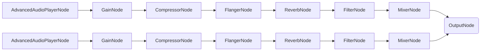

# DJ App - iOS

## Important Links

<a href="https://docs.switchboard.audio/docs/examples/dj-app/" target="_blank">Find more info on the DJ App HERE</a>

<a href="https://docs.switchboard.audio/" target="_blank">Find more info on the Switchboard SDK HERE</a>

## About the DJ App

*DJ apps are really popular in the audio app ecosystem, giving both amateur and professional DJs the tools to mix, scratch, and blend music right from their mobile devices. Creating the perfect mix is an art form, and developing an app to support that art is no less challenging.*

*The conceptual foundation of a DJ app may seem simple, but the actual execution can get complicated, especially when dealing with real-time audio manipulation and synchronization. Elements like beat-matching, crossfading, must be flawlessly integrated to ensure a seamless user experience.*

*Enter SwitchboardSDK. Utilizing this framework significantly eases the development hurdles of building a DJ app. This SDK allows you to tie together different audio nodes, to create a robust, real-time audio manipulation platform. This example aims to demonstrate how you can efficiently construct a high-quality DJ app leveraging the capabilities of SwitchboardSDK.*

## Features

The app has the following **features**:

- Mixing tracks
- Applying various effects
- Beat and tempo sync

### Main Screen

The main screen features volume and effect controls for both tracks, as well as a crossfader that allows for smooth transitions between the tracks.

#### Audio Graph

The audio graph for the Main screen has the following structure:

## Important Links

<a href="https://docs.switchboard.audio/docs/examples/dj-app/" target="_blank">Find more info on the DJ App HERE</a>

<a href="https://docs.switchboard.audio/" target="_blank">Find more info on the Switchboard SDK HERE</a>

